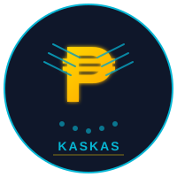
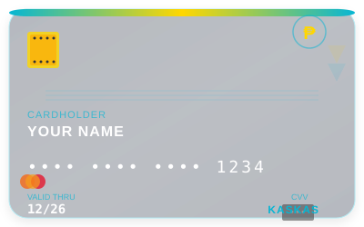

{: width="150" }

# 💰 Kaskas

**Financial memory for Claude. Analyze statements, track dues, find cashback. Local-only.**

{: width="400" }

---

## What is Kaskas?

Kaskas is your personal financial AI assistant for Claude Desktop. It analyzes credit card statements, tracks payments, finds cashback opportunities, and helps you optimize your spending—all locally on your machine with zero external API calls.

**Built for Filipinos** 🇵🇭 - Works with Philippine peso (₱) and local banks.

---

## Quick Install

### Windows
```powershell
irm https://raw.githubusercontent.com/rjramirez/kaskas/main/install.ps1 | iex
```

### macOS / Linux
```bash
curl -fsSL https://raw.githubusercontent.com/rjramirez/kaskas/main/install.sh | bash
```

Then restart Claude Desktop and Claude Code.

---

## Features

| Command | What |
|---------|------|
| `/review` | Analyze credit card statements |
| `/due` | Upcoming payments (next 30 days) |
| `/subscriptions` | Find recurring charges |
| `/offers` | Best card for your spending |
| `/safe` | Utilization risk score |
| `/export` | Export data (JSON / CSV / Markdown) |
| `/ocr` | Extract text from receipts / screenshots |
| `/pdf` | Extract transactions from PDFs |
| `/promos` | Parse card promotional offers |
| `/memory` | SQLite persistent storage |
| `/embed` | Semantic search on transactions |
| `/insights` | Pattern analysis, anomaly detection |
| `/llm` | Local LLM analysis (no API calls) |
| `/remind` | Set payment reminders |
| `/forecast` | Spending forecasts + scenarios |

---

## Works In

| App | How |
|-----|-----|
| Claude Desktop (Windows Store) | MCP server — slash commands in chat |
| Claude Desktop (macOS / Linux) | MCP server — slash commands in chat |
| Claude Code CLI | Plugin — skills + slash commands |
| Claude Code Desktop | Plugin — skills + slash commands |

---

## Quick Start

```
/review
[paste your credit card statement here]
```

Kaskas will:
1. Extract merchant, amount, date
2. Categorize spending
3. Detect recurring charges
4. Flag utilization risks
5. Suggest optimizations

---

## Security

**What kaskas stores:**
- Merchant names (e.g., "Jollibee", "Meralco")
- Transaction amounts and dates
- Last 4 digits of cards (e.g., `****1234`)
- Last 4 digits of account numbers (e.g., `****5678`)

**What kaskas never stores:**
- Full card numbers
- CVV / security codes
- Passwords or PINs
- Full account numbers
- Personal identification numbers

**Why it's safe:**
- Last 4 digits alone cannot be used for fraud
- All data stays on your machine (local-only)
- No external API calls or cloud storage
- Follows PCI DSS and banking industry standards

---

## Privacy

- **Local-only** — no external API calls
- **Your data** — stays on your machine
- **Export anytime** — no lock-in
- **Open source** — inspect the code

---

## Install Location

| Platform | Path |
|----------|------|
| Windows | `%APPDATA%\Claude\kaskas` |
| macOS | `~/Library/Application Support/Claude/kaskas` |
| Linux | `~/.config/Claude/kaskas` |

---

## Uninstall

### Windows
```powershell
powershell -ExecutionPolicy Bypass -File install.ps1 -Uninstall
```

### macOS / Linux
```bash
bash install.sh --uninstall
```

---

## Documentation

- [Installation Guide](./docs/install.md)
- [Command Reference](./docs/commands.md)
- [Security & Privacy](./docs/security.md)
- [Troubleshooting](./docs/troubleshooting.md)
- [FAQ](./docs/faq.md)

---

## License

MIT License - See [LICENSE](https://github.com/rjramirez/kaskas/blob/main/LICENSE) for details.

---

**Made with ❤️ for Claude users who care about their financial data.**
